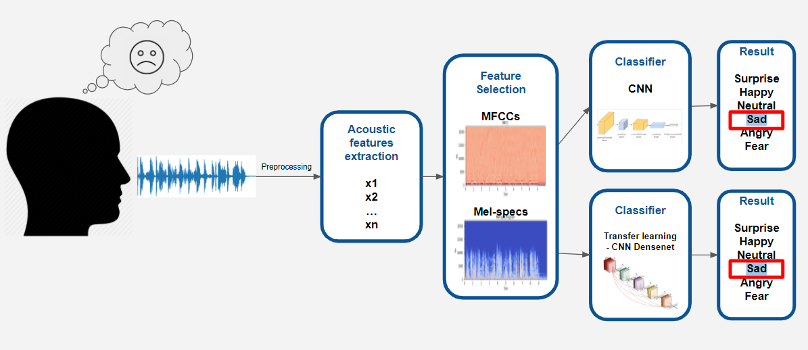

# Speech Emotion Recognition!

Web-application based on ML model for recognition of emotion for selected audio file. You can try it on [**Streamlit**](https://khanhphantt-speed-emotion-classification-app-b38u5z.streamlitapp.com/)


## Description
*Trained datasets:*
* Crowd-sourced Emotional Mutimodal Actors Dataset (**Crema-D**)
* Ryerson Audio-Visual Database of Emotional Speech and Song (**Ravdess**)
* Surrey Audio-Visual Expressed Emotion (**Savee**)
* Toronto emotional speech set (**Tess**)

Typically, the SER task is divided into two main sections: features selection and classification. The discriminative features selection and classification method that correctly recognizes the emotional state of the speaker in this domain is a challenging task

*Methodology*

1. DenseNet for mel-spectrograms features.
2. CNN for mfccs features.
https://towardsdatascience.com/classifying-emotions-using-audio-recordings-and-python-434e748a95eb

For more detailed about EDA and ML models, refer to [**here**](https://github.com/talbaram3192/Emotion_Recognition)

## Installation
It is recommended to use the provided `requirements.txt` file to set your virtual environment.

To install the app run this commands

```sh
!python -m virtualenv your_venv
!your_venv/Scripts/activate
!pip install -r requirements.txt
```
To run the app
```sh
!streamlit run app.py
```
## Usage
Example of an execution:

You can try the app [here](https://khanhphantt-speed-emotion-classification-app-b38u5z.streamlitapp.com/)

## License
[MIT License](http://www.opensource.org/licenses/MIT).
